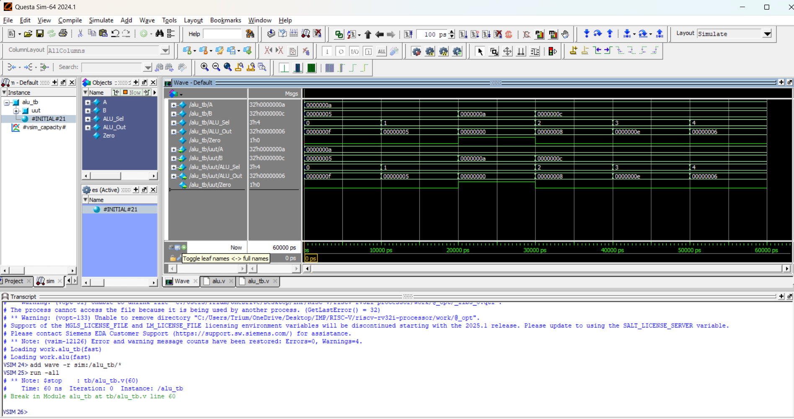

# RV32I RISC-V Processor

A custom 32-bit single-cycle RISC-V processor designed in Verilog HDL.

This project is being built from scratch to understand computer architecture, RTL design, verification, and processor implementation.

---

## Project Goal

Design and verify an RV32I compliant RISC-V processor using Verilog HDL.

The project is developed module-by-module while following an industry-style RTL design workflow.

Each module is:

- Designed in Verilog
- Verified using a dedicated testbench
- Simulated in QuestaSim
- Documented with waveforms
- Version controlled using GitHub

---

## Tools Used

- Verilog HDL
- QuestaSim
- VS Code
- GitHub

---

## Project Architecture

The processor will be built using the following modules:

- [x] ALU
- [ ] Register File
- [ ] Program Counter
- [ ] Instruction Memory
- [ ] Immediate Generator
- [ ] Control Unit
- [ ] Data Memory
- [ ] CPU Top Module
- [ ] Pipeline Implementation

---

## Current Progress

### ALU (Completed)

Implemented a 32-bit Arithmetic Logic Unit.

Supported operations:

| ALU_Sel | Operation |
|---------|-----------|
| 000 | ADD |
| 001 | SUB |
| 010 | AND |
| 011 | OR |
| 100 | XOR |

---

## ALU Block Diagram

```text
          +----------+
A ------->|          |
          |          |
B ------->|   ALU    |-----> ALU_Out
          |          |
ALU_Sel ->|          |
          +----------+
                 |
                 |
               Zero
```

---

## ALU Waveform

<p align="center">



</p>

---

## Folder Structure

```text
riscv-rv32i-processor/

docs/
    waveform.png

src/
    alu.v

tb/
    alu_tb.v

README.md
```

---

## Future Work

- Build 32x32 Register File
- Build Program Counter
- Build Instruction Memory
- Build Immediate Generator
- Build Control Unit
- Build Data Memory
- Integrate all modules into a single-cycle CPU
- Implement a pipelined processor

---

## Author

Shiv Sriram

Electronics and Communication Engineering Student

Learning RTL Design, Computer Architecture and RISC-V Processor Design.
