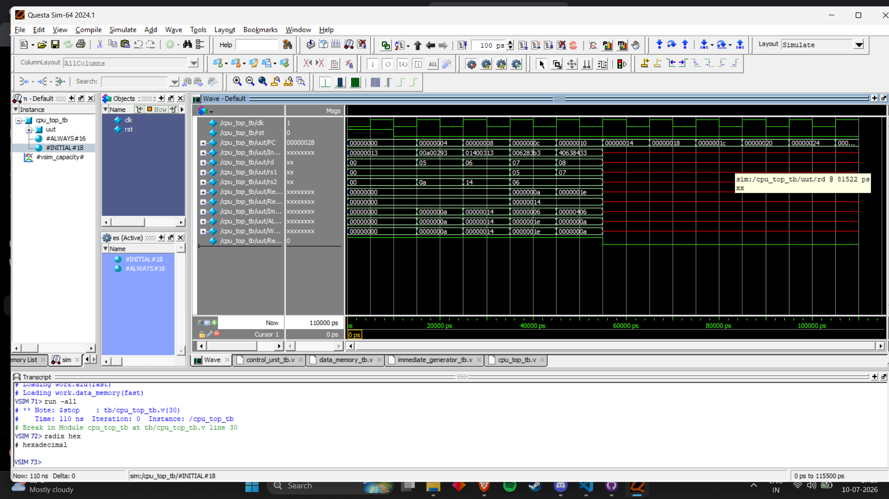
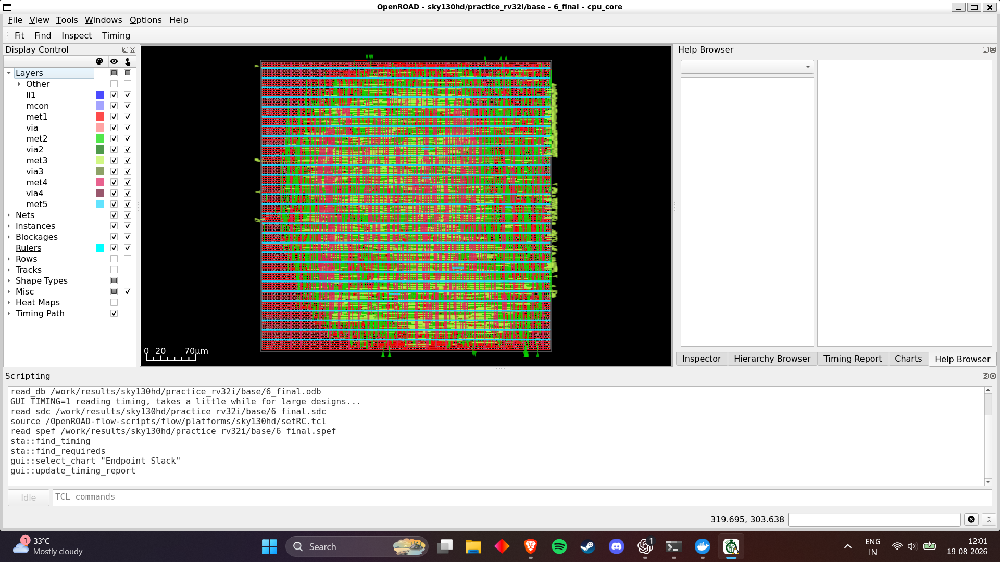
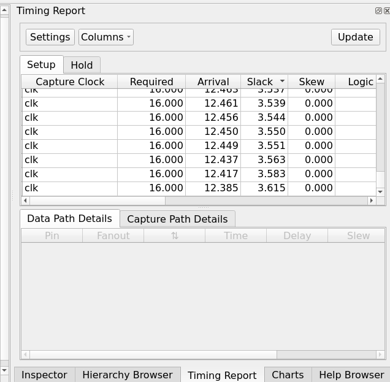
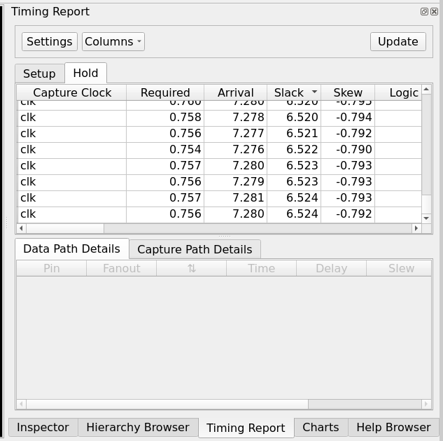
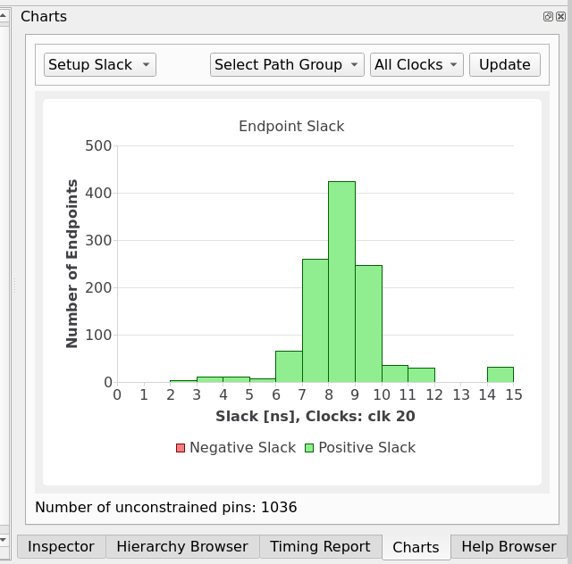
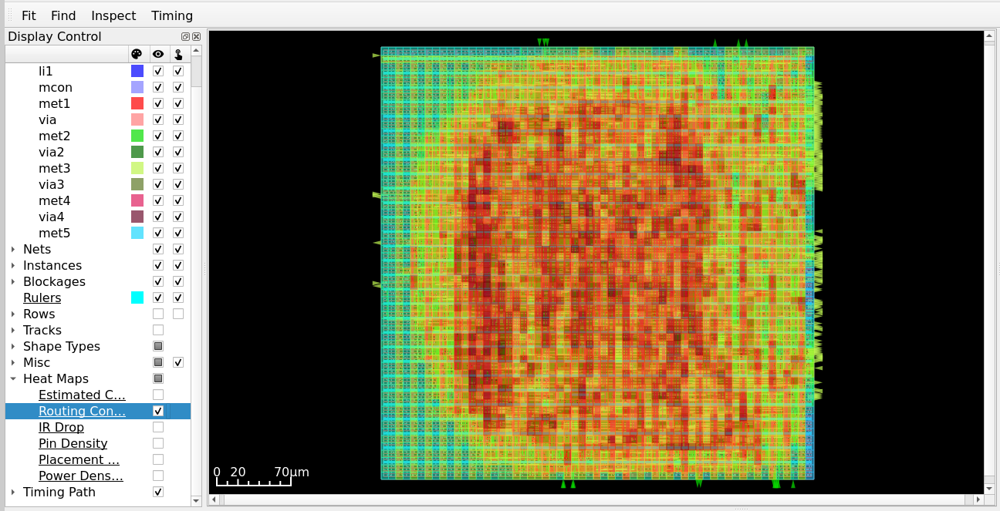
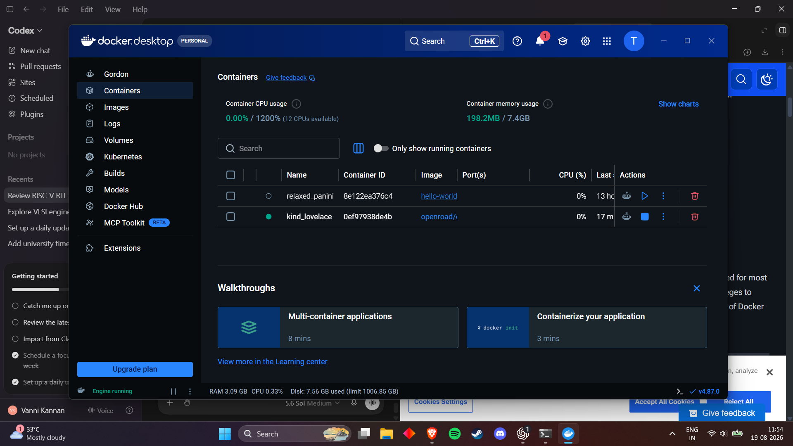
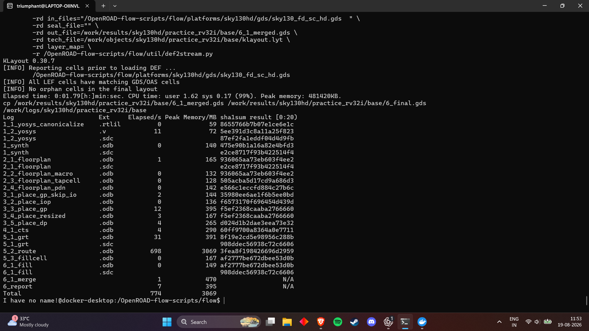

# RV32I Subset RISC-V Processor

A 32-bit single-cycle processor implementing a basic subset of the RISC-V RV32I instruction set in Verilog HDL and simulated using QuestaSim.

The processor is built using modular RTL blocks and supports a basic subset of RV32I instructions including arithmetic, immediate, memory, and branch-related control logic.

---

## Tools Used

- Verilog HDL
- QuestaSim
- OpenROAD Flow Scripts
- SkyWater SKY130 HD standard-cell platform
- Docker Desktop with WSL2
- VS Code
- GitHub

---

## Currently Supported Instructions

| Instruction | Type | Operation |
|------------|------|-----------|
| `nop` | I-Type | No operation |
| `addi` | I-Type | Add immediate |
| `add` | R-Type | Add two registers |
| `sub` | R-Type | Subtract two registers |
| `and` | R-Type | Bitwise AND |
| `or` | R-Type | Bitwise OR |
| `xor` | R-Type | Bitwise XOR |
| `lw` | I-Type | Load word from data memory |
| `sw` | S-Type | Store word to data memory |
| `beq` | B-Type | Branch if equal |

---

## Project Structure

```text
riscv-rv32i-processor/

docs/
    openroad-results/
        01-final-routed-layout.png
        02-setup-timing-positive-slack.png
        03-hold-timing-positive-slack.png
        04-endpoint-slack-distribution.png
        05-routing-congestion-heatmap.png
        06-power-and-ir-drop-report.png
        07-final-gds-generation-success.png
    waveform.png
    program_counter_waveform.png
    instruction_memory_waveform.png
    immediate_generator_waveform.png
    data_memory_waveform.png
    control_unit_waveform.png
    Final_CPU.png

src/
    alu.v
    register_file.v
    program_counter.v
    instruction_memory.v
    immediate_generator.v
    control_unit.v
    data_memory.v
    cpu_core.v
    cpu_top.v

openroad/
    config.mk
    constraint.sdc
    README.md

tb/
    alu_tb.v
    register_file_tb.v
    program_counter_tb.v
    instruction_memory_tb.v
    immediate_generator_tb.v
    control_unit_tb.v
    data_memory_tb.v
    cpu_top_tb.v
```

---

## Processor Architecture

The processor is implemented as a single-cycle datapath. Each instruction is fetched, decoded, executed, and written back within one clock cycle.

```text
Program Counter
      |
      v
Instruction Memory
      |
      v
Instruction Decode
      |
      +------------------+
      |                  |
      v                  v
Control Unit       Register File
      |                  |
      |                  v
      |          Immediate Generator
      |                  |
      +---------> ALU <---+
                    |
                    v
              Data Memory
                    |
                    v
              Write Back
```

---

## Module Overview

| Module | Description |
|--------|-------------|
| `program_counter.v` | Stores the current instruction address and updates to the next address on every clock cycle. |
| `instruction_memory.v` | Stores the instruction sequence and outputs the instruction based on the current PC value. |
| `control_unit.v` | Decodes opcode, funct3, and funct7 fields to generate control signals. |
| `register_file.v` | Implements 32 registers of 32-bit width with two read ports and one write port. Register `x0` is hardwired to zero. |
| `immediate_generator.v` | Extracts and sign-extends immediate values for I-Type, S-Type, and B-Type instructions. |
| `alu.v` | Performs arithmetic and logical operations such as ADD, SUB, AND, OR, and XOR. |
| `data_memory.v` | Supports load and store operations using `lw` and `sw`. |
| `cpu_top.v` | Connects all modules to form the complete single-cycle processor. |

---

## CPU Interconnections

### 1. Program Counter to Instruction Memory

The Program Counter provides the address of the current instruction.

```verilog
instruction_memory IMEM (
    .PC(PC),
    .Instruction(Instruction)
);
```

The instruction memory uses:

```verilog
Instruction = memory[PC[31:2]];
```

This converts byte addressing into word addressing.

```text
PC = 0   -> memory[0]
PC = 4   -> memory[1]
PC = 8   -> memory[2]
PC = 12  -> memory[3]
```

---

### 2. Instruction Field Extraction

The 32-bit instruction is split into RISC-V instruction fields.

```verilog
opcode = Instruction[6:0];
rd     = Instruction[11:7];
funct3 = Instruction[14:12];
rs1    = Instruction[19:15];
rs2    = Instruction[24:20];
funct7 = Instruction[31:25];
```

These fields are passed to the Control Unit and Register File.

---

### 3. Control Unit

The Control Unit generates control signals based on the instruction type.

| Signal | Purpose |
|--------|---------|
| `RegWrite` | Enables writing into the register file |
| `ALUSrc` | Selects ALU second input from register or immediate |
| `MemRead` | Enables data memory read |
| `MemWrite` | Enables data memory write |
| `MemtoReg` | Selects write-back data from memory or ALU |
| `Branch` | Enables branch decision logic |
| `ImmSel` | Selects immediate format |
| `ALU_Sel` | Selects ALU operation |

---

### 4. Register File to ALU

The Register File provides two source operands.

```verilog
ReadData1 = registers[rs1];
ReadData2 = registers[rs2];
```

For R-Type instructions:

```text
ALU input A = ReadData1
ALU input B = ReadData2
```

For I-Type, Load, and Store instructions:

```text
ALU input B = Immediate value
```

This selection is done using:

```verilog
assign ALU_B = (ALUSrc) ? ImmOut : ReadData2;
```

---

### 5. Immediate Generator

The Immediate Generator extracts constants from instructions.

Examples:

| Instruction | Immediate |
|------------|-----------|
| `addi x5, x0, 10` | `10` |
| `sw x5, 8(x1)` | `8` |
| `beq x5, x6, 8` | `8` |

The module supports:

```text
I-Type immediate
S-Type immediate
B-Type immediate
```

---

### 6. ALU to Data Memory

The ALU performs arithmetic or address calculation.

For arithmetic instructions:

```text
ALU_Out = calculation result
```

For memory instructions:

```text
ALU_Out = memory address
```

Example:

```assembly
lw x5, 0(x1)
sw x5, 0(x1)
```

The ALU calculates:

```text
Address = x1 + immediate
```

---

### 7. Write Back Path

The result written back to the register file is selected using `MemtoReg`.

```verilog
assign WriteBackData = (MemtoReg) ? MemReadData : ALU_Out;
```

For arithmetic instructions:

```text
WriteBackData = ALU_Out
```

For load instructions:

```text
WriteBackData = MemReadData
```

---

### 8. PC Update Logic

The processor normally moves to the next instruction using:

```verilog
PC_plus_4 = PC + 4;
```

For branch instructions:

```verilog
Branch_Target = PC + ImmOut;
Branch_Taken  = Branch & Zero;
```

Final PC selection:

```verilog
PC_next = (Branch_Taken) ? Branch_Target : PC_plus_4;
```

---

## Test Program Used in CPU Top

The instruction memory was initialized with the following test program:

```assembly
nop
addi x5, x0, 10
addi x6, x0, 20
add  x7, x5, x6
sub  x8, x7, x6
```

Machine code stored in instruction memory:

| Address | Instruction | Assembly |
|---------|-------------|----------|
| `0` | `00000013` | `nop` |
| `4` | `00A00293` | `addi x5, x0, 10` |
| `8` | `01400313` | `addi x6, x0, 20` |
| `12` | `006283B3` | `add x7, x5, x6` |
| `16` | `40638433` | `sub x8, x7, x6` |

Expected register results:

| Register | Expected Value | Hex |
|----------|----------------|-----|
| `x5` | `10` | `0000000A` |
| `x6` | `20` | `00000014` |
| `x7` | `30` | `0000001E` |
| `x8` | `10` | `0000000A` |

---

## Simulation Results


### Final CPU Integration Waveform



---

## Simulation Summary

| Module | Testbench | Status |
|--------|-----------|--------|
| ALU | `alu_tb.v` | Simulated |
| Register File | `register_file_tb.v` | Simulated |
| Program Counter | `program_counter_tb.v` | Simulated |
| Instruction Memory | `instruction_memory_tb.v` | Simulated |
| Immediate Generator | `immediate_generator_tb.v` | Simulated |
| Control Unit | `control_unit_tb.v` | Simulated |
| Data Memory | `data_memory_tb.v` | Simulated |
| CPU Top | `cpu_top_tb.v` | Simulated |

---

## Current Status

The educational single-cycle RV32I-subset processor has been simulated at the
module and CPU levels and has completed an RTL-to-GDSII physical-design flow
with OpenROAD Flow Scripts on the SKY130 HD platform.

The current verification is suitable for an educational project, but it is not
a claim of production tapeout readiness. The testbenches do not yet provide an
official RISC-V ISA compliance suite, exhaustive assertions, or gate-level
regression. The external instruction/data interfaces also require
system-specific I/O-delay constraints before full timing signoff.

---

## OpenROAD RTL-to-GDSII Result

`cpu_core` is the synthesis top used by OpenROAD. It exposes instruction and
data-memory buses so that memories and peripherals can be supplied by the
surrounding system. `cpu_top` remains the self-contained simulation wrapper.

The supplied `openroad/config.mk` and `openroad/constraint.sdc` target the
SKY130 HD platform with a 20 ns clock period (50 MHz) and 35% core utilization.
The flow completed synthesis, floorplanning, placement, clock-tree synthesis,
detailed routing, fill, reporting, and GDS merge.

### Recorded implementation results

| Item | Result |
|------|--------|
| Platform | SkyWater SKY130 HD |
| Synthesis top | `cpu_core` |
| Clock target | 20 ns / 50 MHz |
| Core utilization | 35% |
| Floorplan design area | 57,149 µm² |
| Placed cells reported | 25,161 including physical-only cells |
| Worst setup slack visible in GUI | +3.537 ns |
| Worst hold slack visible in GUI | +6.520 ns |
| Estimated total power | 5.28 mW |
| Worst reported VDD IR drop | 93.8 µV (0.01%) |
| Final artifact | `results/sky130hd/practice_rv32i/base/6_final.gds` |

The final layout loaded successfully with its SDC and extracted SPEF timing
data. KLayout reported matching LEF/GDS cells and no orphan cells in the final
layout.

### Final routed layout



### Post-route timing

| Setup timing | Hold timing |
|---|---|
|  |  |



### Routing congestion



### Power and IR-drop report



### Successful GDS generation



### Signoff limitations

- The GUI reported 1,036 unconstrained pins because the external instruction
  and data interfaces do not yet have system-specific input/output delays.
- The run used `LEC_CHECK=0` as a workaround for an instruction-set
  compatibility problem in the prebuilt ORFS Docker image, so formal logical
  equivalence was not executed in this run.
- Foundry signoff DRC/LVS, antenna signoff, package/pad integration, and
  production power-integrity analysis remain outside this educational flow.

See `openroad/README.md` for the reproducible run command and output paths.

### OpenROAD attribution

Physical implementation and analysis were performed with the open-source
[OpenROAD](https://github.com/The-OpenROAD-Project/OpenROAD) application through
[OpenROAD-flow-scripts (ORFS)](https://github.com/The-OpenROAD-Project/OpenROAD-flow-scripts).
OpenROAD provides the unified physical-design engines, database, timing
analysis, and GUI; ORFS supplies the reproducible RTL-to-GDSII flow used for
this project.

When referencing this implementation, please also cite the official OpenROAD
and OpenROAD-flow-scripts repositories above. Their respective repositories
contain the current licenses, documentation, contributors, and recommended
academic citations.
